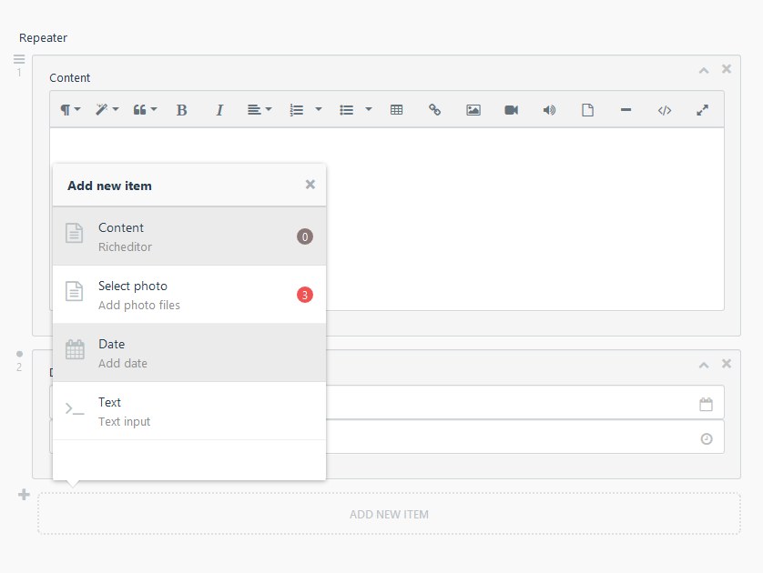

# Groups Limit
  
This plugin Extend Groups in repeater. The ability to limit the number of objects from a specific group.
  



## Installation
  
Install the plugin via October's plugin marketplace:
https://octobercms.com/plugin/brown-groupslimit

Or from github:
```
$ cd project/plugins
$ git clone https://github.com/StefanBrown/oc-groupslimit-plugin.git ./brown/groupslimit
```
  
## Usage  

To the repeater field, add css property `data-groups-limit` for auto initialization and css properties in the format `limit-(group)-(maxitems)-badge` the latter can be skipped if the icon is not needed.


##### You should get something like this:

```yaml
fields:
    repeater:
        label: Repeater
        prompt: 'Add new item'
        span: full
        type: repeater
        cssClass: data-groups-limit limit-content-1-badge limit-photo-3-badge limit-date-1
        groups:
            content:
                name: Content
                description: Richeditor
                icon: icon-file-text-o
                fields:
                    value:
                        label: Content
                        type: richeditor
                        size: huge
            photo:
                name: Select photo
                description: Add photo files
                icon: icon-file-text-o
                fields:
                    file:
                        label: Photo
                        mode: image
                        useCaption: true
                        thumbOptions:
                            mode: crop
                            extension: auto
                        span: auto
                        type: mediafinder
            date:
                name: Date
                description: Add date
                icon: icon-calendar
                fields:
                    time:
                        label: 'Date picker'
                        mode: datetime
                        span: auto
                        type: datepicker
            text:
                name: Text
                description: Text input
                icon: icon-terminal
                fields:
                    string:
                        label: Text
                        span: full
                        type: text
```
